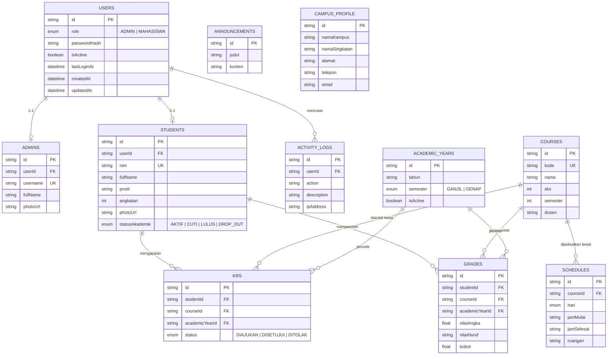

# Entity Relationship Diagram — SIAKAD Smart Campus

Mencerminkan `prisma/schema.prisma` persis. Rendering Mermaid otomatis di GitHub, GitLab, VS Code (ekstensi Markdown Preview Mermaid), dan [Mermaid Live Editor](https://mermaid.live).

## Catatan Desain

- **`users` terpisah dari `admins`/`students`** — tabel auth (kredensial + role) dipisah dari tabel profil, supaya logika login tidak bercampur dengan data akademik. Admin dan mahasiswa sama-sama punya baris `users`, dibedakan lewat kolom `role`.
- **`krs` dan `grades` punya unique constraint gabungan** `(studentId, courseId, academicYearId)` — mencegah satu mahasiswa mengambil/dinilai dua kali untuk mata kuliah yang sama di semester yang sama.
- **`campus_profile` adalah tabel singleton** (sengaja tidak berelasi ke tabel manapun) — hanya diisi satu baris saat seeding dan diperbarui (bukan ditambah) lewat menu Pengaturan admin.
- **`onDelete: Cascade`** dipakai di sebagian besar relasi (mis. hapus `students` otomatis hapus `krs`/`grades` terkait) kecuali `activity_logs.userId` yang `SetNull` — supaya log tetap ada meski akun penggunanya dihapus.
