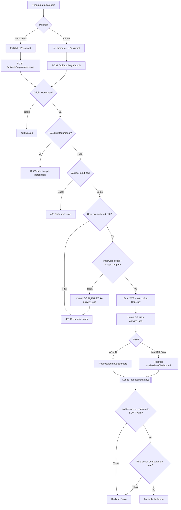
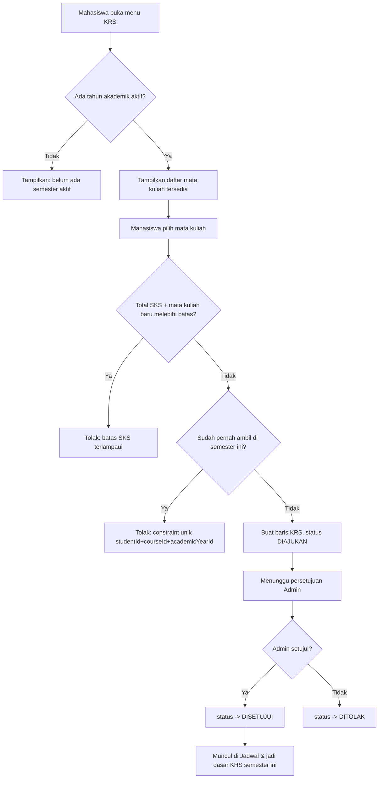
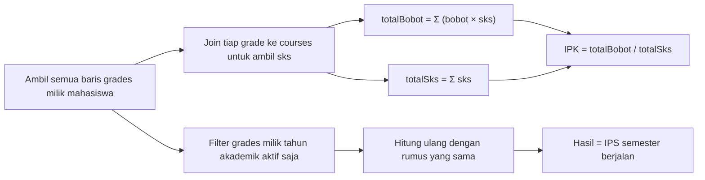

# Flowchart Sistem — SIAKAD Smart Campus

## 1. Alur Autentikasi & RBAC

## 2. Alur Pengajuan KRS (Kelola KRS — modul tahap berikutnya)

## 3. Alur Perhitungan IPK / IPS (sudah aktif di Dashboard Mahasiswa)

